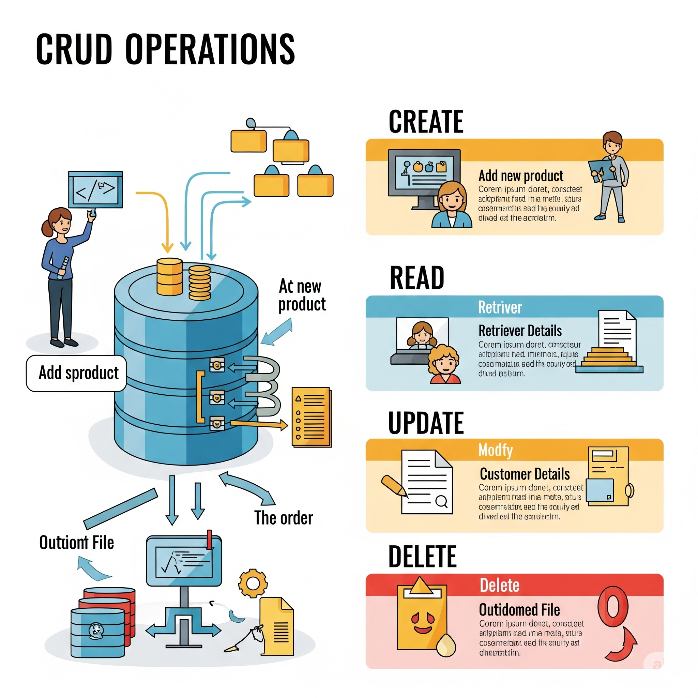
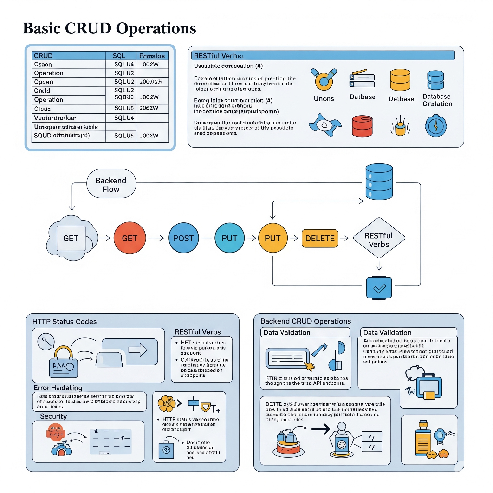
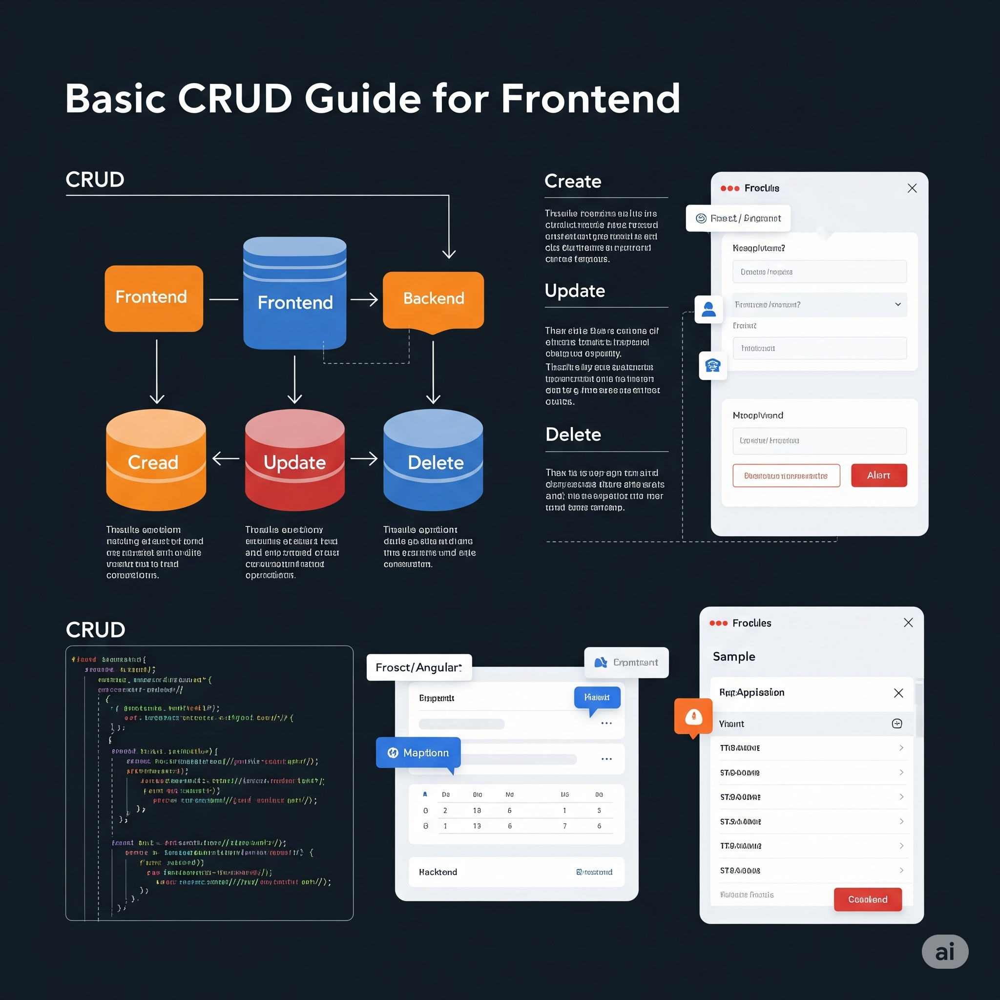
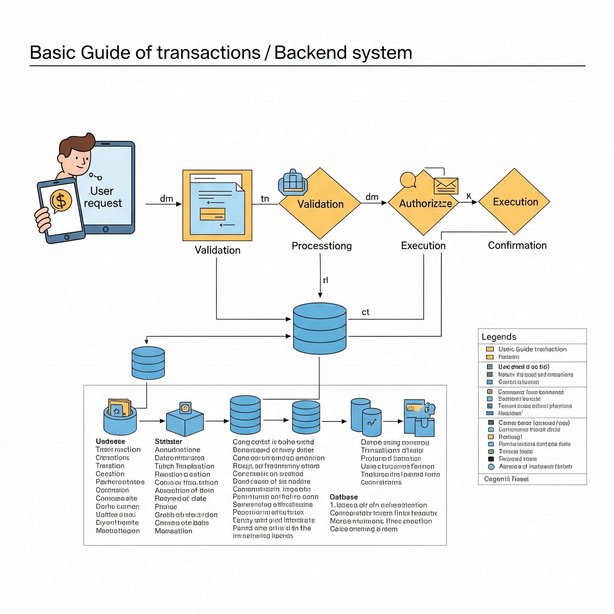
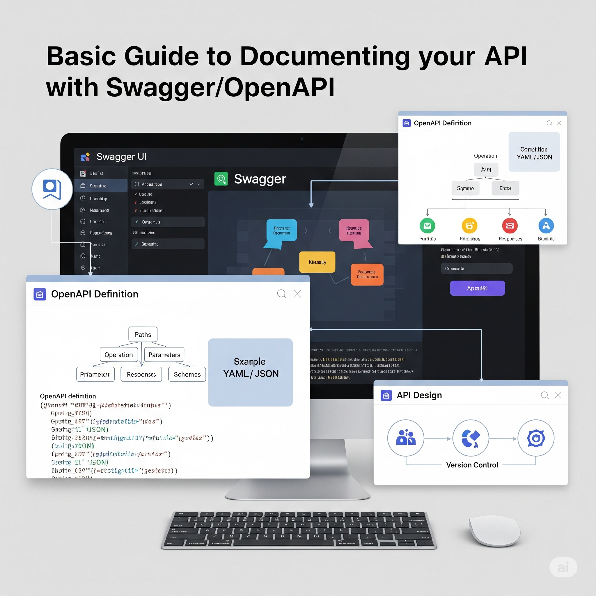
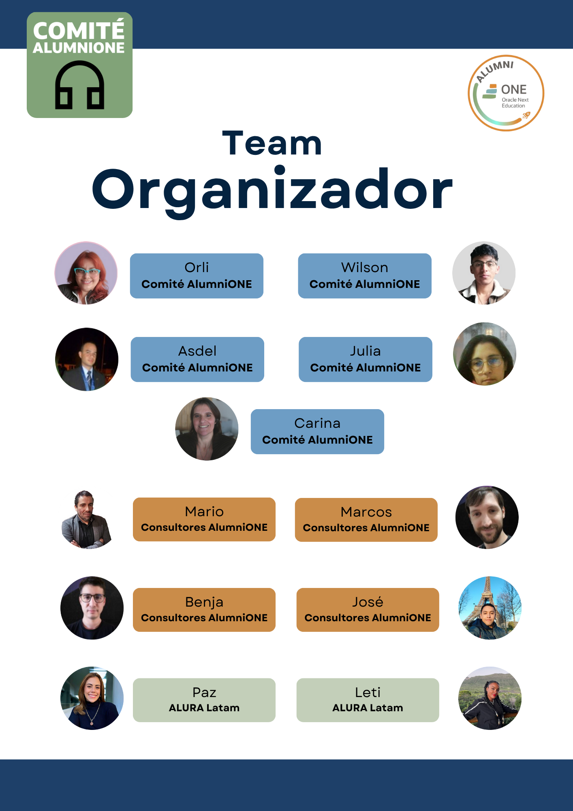
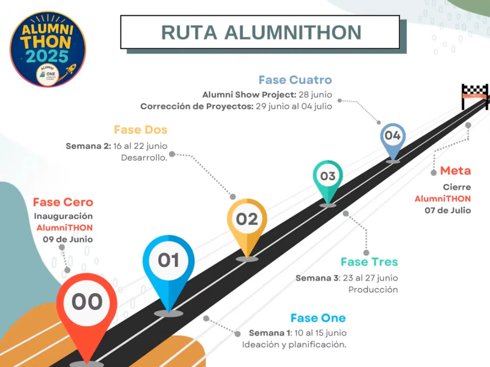

# Alumnithon 2025

Bienvenido a **Alumnithon**, una iniciativa que busca acercar a los egresados del programa Oracle Next Education (ONE) a un ambiente profesional de desarrollo a través de un emocionante hackathon. Esta experiencia única permite a los participantes demostrar sus habilidades técnicas, trabajar en equipo y conectar con empresas que buscan talento joven.

---

## 📚 Recursos y Documentación

### 🖼️ Guías Visuales de Desarrollo

<strong>🔧 Operaciones CRUD y Arquitectura</strong>

### 🏛️ Organización del Evento

### 📋 Documentos Oficiales

- 📄 **[Rúbrica Evaluativa de Equipos](../assets/pdfs/Rúbrica%20evaluativa%20Equipos.pdf)** - Criterios detallados de evaluación
- 🗺️ **[Ruta del Alumnithon](../assets/pdfs/Ruta%20Alumnithon.pdf)** - Guía completa del proceso del hackathon

---

## 🚀 Hackathon Edición 2025

### 📋 Condiciones

- **Duración:** 4 semanas
- **Fecha:** 10 de Junio 2025 - 28 de Junio 2025
- **Modalidad:** Remoto
- **Participantes:** Egresados del programa Oracle Next Education y Debes haber finalizado las formaciones de AlumniONE. ¡Ese es tu pase directo al AlumniTHON!
- **Herramientas:** GitHub, Discord, Trello, y otras herramientas de colaboración

### 🎯 Objetivo

El objetivo del hackathon es desarrollar un proyecto innovador que resuelva un problema real o mejore un proceso existente. Los participantes tendrán la oportunidad de aplicar sus conocimientos en programación, diseño y gestión de proyectos, mientras trabajan en equipo para crear una solución funcional.

### 👥 Definición de Grupos

- Cada grupo estará formado por **10 participantes** con roles backend y frontend
- Los equipos serán formados por **huso horario** y **habilidades complementarias**
- Se fomentará la **diversidad** en los equipos para enriquecer la experiencia de aprendizaje

### 🛠️ Roles y Responsabilidades

- Se asignará un **mentor técnico** por equipo
- El equipo consta de roles **backend** y **frontend**
- Cada equipo deberá designar:
  - Un **líder de proyecto**
  - **Roles técnicos** según las necesidades del proyecto

### 🎯 RÚBRICA DE EVALUACIÓN
**Alumnithon 2025**

📋 **Guía para equipos**

✨ **¿Por qué una rúbrica?**
Para garantizar una evaluación clara, justa y equilibrada de todos los equipos participantes.

Cada proyecto será revisado por múltiples jueces con criterios técnicos y humanos.

🧠 Tu mirada como jurado es clave para valorar el esfuerzo, la creatividad y el trabajo en equipo.

🧩 **Evaluación integral de proyectos**

👨‍⚖️👩‍⚖️ **Jueces:** Marcos • Benjamín • José • Mario • Néstor • Isaac

🕐 **Duración estimada por evaluación:** 10-15 minutos por equipo

---

#### 🟣 Criterios de Evaluación

**🎨 Front-End**
- Diseño visual
- Navegación clara
- Adaptabilidad (responsive)
- Experiencia de usuario

**🛠 Back-End**
- Lógica y arquitectura
- Integraciones funcionales
- Buenas prácticas (código limpio, modularidad)
- Seguridad básica

**🤝 Trabajo en Equipo**
- Organización y roles
- Comunicación
- Adaptación a los cambios
- Participación equitativa

**📢 Pitch de Presentación**
- Claridad y narrativa
- Presentación visual y oral
- Tiempo bien gestionado
- Impacto de la solución

### 🚀 ¿Cómo participar?

1. **Asegúrate** de ser egresado del programa Oracle Next Education
2. **Únete** al servidor de Discord del evento
3. **Completa** el formulario de registro
4. **Espera** la confirmación de tu equipo

### 📞 Contacto

Para más información, mantente atento a los **canales oficiales**.

---

*¡Esperamos verte en el Alumnithon 2025! 🎉*
