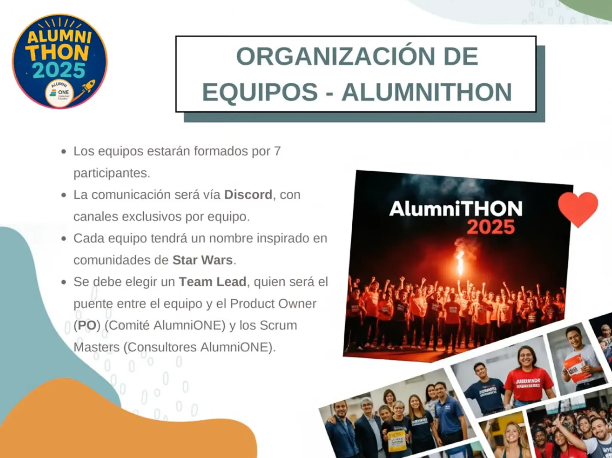

# Alumnithon 2025


Bienvenido a **Alumnithon**, una iniciativa que busca acercar a los egresados del programa Oracle Next Education (ONE) a un ambiente profesional de desarrollo a través de un emocionante hackathon. Esta experiencia única permite a los participantes demostrar sus habilidades técnicas, trabajar en equipo y conectar con empresas que buscan talento joven.


---

## 📚 Recursos y Documentación

### 🖼️ Guías Visuales de Desarrollo


<details>
<summary><strong>🔧 Operaciones CRUD y Arquitectura</strong></summary>


</details>


### 🏛️ Organización del Evento


### 📋 Documentos Oficiales


- 📄 **[Rúbrica Evaluativa de Equipos](../assets/pdfs/Rúbrica%20evaluativa%20Equipos.pdf)** - Criterios detallados de evaluación
- 🗺️ **[Ruta del Alumnithon](../assets/pdfs/Ruta%20Alumnithon.pdf)** - Guía completa del proceso del hackathon


---

## 🚀 Hackathon Edición 2025


### 📋 Condiciones


- **Duración:** 4 semanas
- **Fecha:** 10 de Junio 2025 - 28 de Junio 2025
- **Modalidad:** Remoto
- **Participantes:** Egresados del programa Oracle Next Education y Debes haber finalizado las formaciones de AlumniONE. ¡Ese es tu pase directo al AlumniTHON!
- **Herramientas:** GitHub, Discord, Trello, y otras herramientas de colaboración


### 🎯 Objetivo


El objetivo del hackathon es desarrollar un proyecto innovador que resuelva un problema real o mejore un proceso existente. Los participantes tendrán la oportunidad de aplicar sus conocimientos en programación, diseño y gestión de proyectos, mientras trabajan en equipo para crear una solución funcional.


### 👥 Definiciones del Hackathon



### 🎯 RÚBRICA DE EVALUACIÓN
**Alumnithon 2025**

📋 **Guía para equipos**

✨ **¿Por qué una rúbrica?**
Para garantizar una evaluación clara, justa y equilibrada de todos los equipos participantes.

Cada proyecto será revisado por múltiples jueces con criterios técnicos y humanos.

🧠 Tu mirada como jurado es clave para valorar el esfuerzo, la creatividad y el trabajo en equipo.

🧩 **Evaluación integral de proyectos**

👨‍⚖️👩‍⚖️ **Jueces:** Marcos • Benjamín • José • Mario • Néstor • Isaac

🕐 **Duración estimada por evaluación:** 10-15 minutos por equipo

---

#### 🟣 Criterios de Evaluación

**🎨 Front-End**
- Diseño visual
- Navegación clara
- Adaptabilidad (responsive)
- Experiencia de usuario

**🛠 Back-End**
- Lógica y arquitectura
- Integraciones funcionales
- Buenas prácticas (código limpio, modularidad)
- Seguridad básica

**🤝 Trabajo en Equipo**
- Organización y roles
- Comunicación
- Adaptación a los cambios
- Participación equitativa

**📢 Pitch de Presentación**
- Claridad y narrativa
- Presentación visual y oral
- Tiempo bien gestionado
- Impacto de la solución

### �️ Equipo 6 - Stormtrooper

**Estado:** En desarrollo | **Fecha:** 10-28 Junio 2025

---

#### 👥 Equipos Participantes

##### Full Stack Members

-  🚀 **Jissy Kakin Merlano Zabaleta** [jissykakin](https://github.com/jissykakin) - _**Project Lead (PL)** - Fullstack + DBA_
  - ```bash
    sicaji22@gmail.com
    ```

##### 🚀 Stormtroopers Team

###### Backend Squad
**Repositorio:** [skilllink-g6b](https://github.com/alumnithon/skilllink-g6b)
**Miembros asignados:**

-  👨‍💻 **Carlos Eduardo Ferreyra** [carlosferreyra](https://github.com/carlosferreyra) - _Backend + DevOps_
  - ```bash
    eduferreyraok@gmail.com
    ```

-  👨‍💻 **Emanuel Peracchia** [emanuelperacchia](https://github.com/emanuelperacchia) - _Backend_
  - ```bash
    emanuelperacchia@gmail.com
    ```

###### Frontend Squad
**Repositorio:** [skilllink-g6f](https://github.com/alumnithon/skilllink-g6f)
**Miembros asignados:**

-  🨠**Armando Rios** [armando-rios](https://github.com/armando-rios) - _Frontend-Arq Frontend_
  - ```bash
    armandorios.dev@gmail.com
    ```

-  🨠**Linamaria Martinez** [LinamariaMartinez](https://github.com/LinamariaMartinez) - _Frontend + UX/UI_
  - ```bash
    linamariamartinezp@gmail.com
    ```

-  🨠**Yatzaré Hernández** [yatzare-hernandez](https://github.com/yatzare-hernandez) - _Frontend_
  - ```bash
    yatzarehernandez@gmail.com
    ```

---

#### 📋 Gestión de Proyectos

##### 🎯 Tracking de Tareas
- **Jira:** [https://carlosferreyra.atlassian.net/jira/software/projects/SKIL/boards/2/](https://carlosferreyra.atlassian.net/jira/software/projects/SKIL/boards/2/)

> 📝 **Nota:** Utilizamos Jira para la gestión de proyectos y seguimiento de tareas.

---

#### 🔗 Enlaces Rápidos


- 💬 Discord: https://discord.gg/sSFP8z7y
- 🎨 Figma: https://www.figma.com/files/team/1515731411713838983/all-projects
- 📧 Contacto: contacto@carlosferreyra.me

---

**Última actualización:**
- 28/06/2025 02:48 (Argentina)
- 28/06/2025 00:48 (Colombia)
- 27/06/2025 23:48 (México)

### �🚀 ¿Cómo participar?


1. **Asegúrate** de ser egresado del programa Oracle Next Education
2. **Únete** al servidor de Discord del evento
3. **Completa** el formulario de registro
4. **Espera** la confirmación de tu equipo


### 📞 Contacto


Para más información, mantente atento a los **canales oficiales**.


---


*¡Esperamos verte en el Alumnithon 2025! 🎉*
